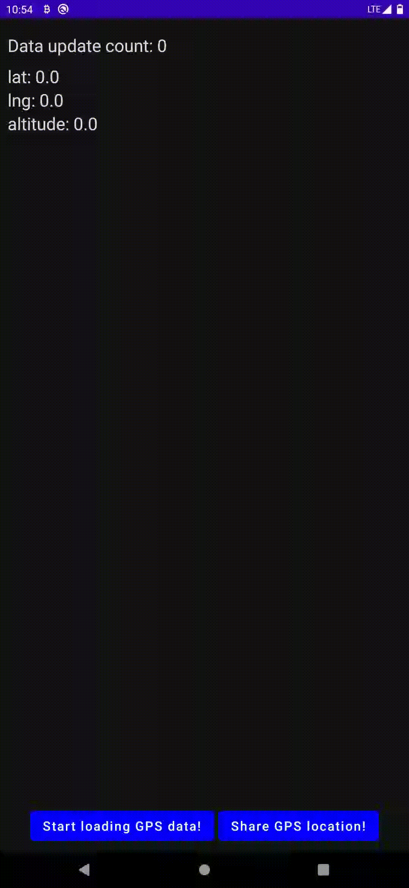

   

# Description
**LocationInfo** is application for devices with Android operating system which uses **Jetpack Compose** toolkit to present layout.  
Program allows to get current user location from GPS. There is also possibility to share current position, for example through SMS in emergency situation.  

# Install
Download and install newest LocationInfo*.apk file from **Releases** section (*install from unknown sources* option must be enabled in settings of Android system).

# Todo
I'm planning constant development of this project. In closest future I want to add following features:
- [ ] Fetching coarse location from cellular network
- [ ] Add more information (like number of available satellites and quality of signal)
- [ ] Possibility to save favorites location to local database

# Demo  
**Attached GIF file has big size, it may take a longer while to be loaded.**  

 
